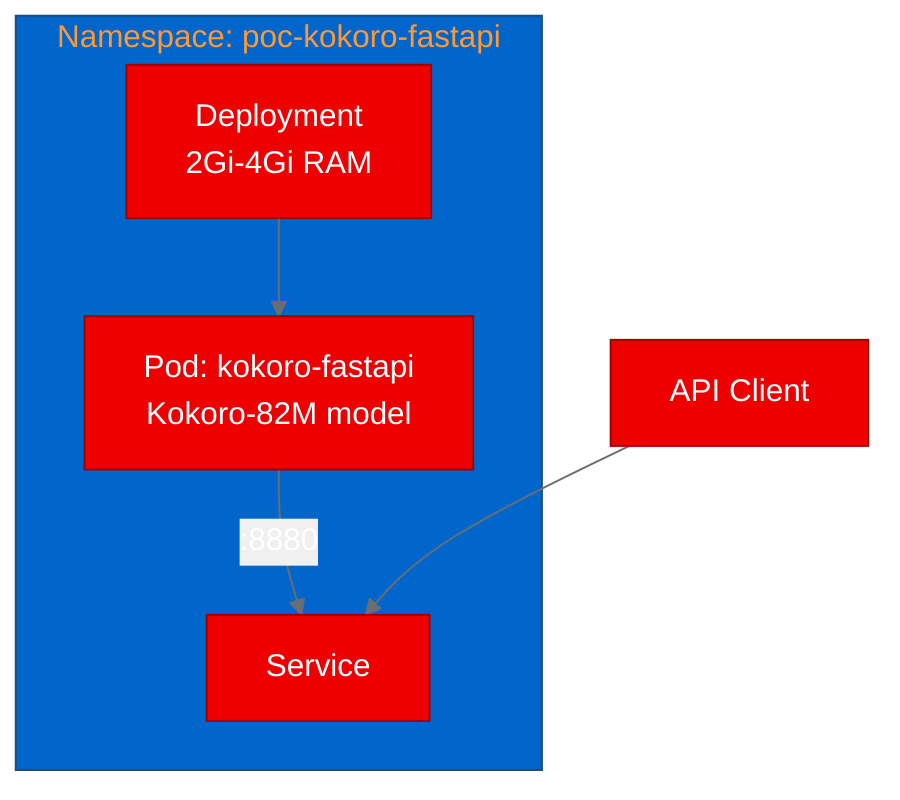
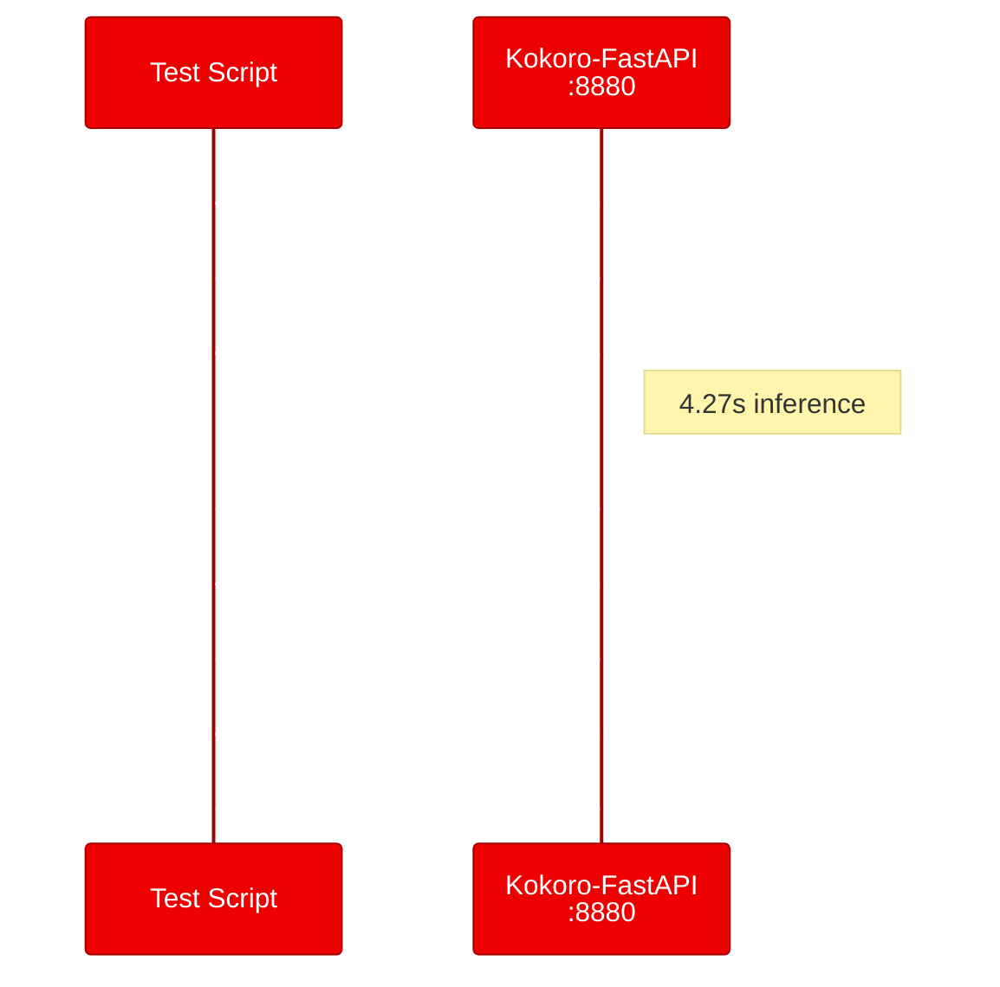

## Deploying Kokoro-FastAPI on OpenShift: text-to-speech for AI platforms

We wanted to know if a text-to-speech model could run reliably on Red Hat OpenShift AI without a GPU. Kokoro-FastAPI, an open-source FastAPI wrapper for the Kokoro-82M model, seemed like a good candidate: it has an OpenAI-compatible API, pre-built container images, and CPU inference support. So we deployed it and ran a proof of concept.

**Want to try this yourself?** The complete deployment manifests and test scripts are on [GitHub](https://github.com/aicatalyst-team/Kokoro-FastAPI).

## What is Kokoro-FastAPI?

Kokoro-FastAPI wraps the Kokoro-82M text-to-speech model in a FastAPI service that's compatible with OpenAI's audio speech API. It supports 9 languages, 67 voices, streaming audio, voice mixing, and phoneme generation. The project ships with pre-built Docker images for CPU, NVIDIA GPU, and AMD GPU (ROCm), plus a Helm chart and a built-in web player for testing.

The Kokoro-82M model is small enough (82 million parameters) to run comfortably on CPU, making it accessible without GPU allocation. That's a significant advantage for platform teams who want to add speech synthesis to their AI stack without competing for GPU resources.

## Why text-to-speech on OpenShift AI?

As [Red Hat OpenShift AI](https://www.redhat.com/en/technologies/cloud-computing/openshift/openshift-ai) platforms mature beyond text-based inference, teams are exploring multi-modal capabilities. Text-to-speech fills several practical needs:

- Accessibility for AI-generated content
- Voice interfaces for agent-driven workflows
- Audio generation for content pipelines
- Read-aloud features for document processing outputs

An OpenAI-compatible TTS endpoint makes integration straightforward since many frameworks and clients already support the `/v1/audio/speech` API format.

## Deploying on OpenShift

We used the pre-built CPU image (`ghcr.io/remsky/kokoro-fastapi-cpu:v0.5.0`) rather than building from source. The upstream Dockerfile requires a Rust toolchain, model downloads (~330 MB), and a Japanese dictionary (~526 MB), making the build complex. The pre-built image bundles everything at about 4 GB.

The deployment is simple: one Deployment, one Service, no persistent storage needed since the model is baked into the image:

We ran into one OpenShift-specific issue: the container tried to write to `/.cache/uv` on startup and hit a permission error. OpenShift assigns a random user ID (UID) that doesn't have write access to the root home directory. The fix was setting `HOME=/tmp` and `UV_CACHE_DIR=/tmp/uv-cache` as environment variables in the Deployment manifest.

We allocated 2 Gi memory request and 4 Gi limit, with 1 to 2 CPU cores. The model loads in about 30 to 60 seconds on cold start, so we set liveness and readiness probe delays to 60 and 90 seconds respectively.

## Testing the TTS API

We ran four test scenarios from inside the cluster:

**Health check**: The /health endpoint returned `{"status":"healthy"}` immediately.

**Text-to-speech generation**: We sent a 15-word sentence to `/v1/audio/speech` and received a 217 KB WAV file in 4.27 seconds. The request used the `af_heart` voice with the `kokoro` model.

**Voice listing**: The `/v1/audio/voices` endpoint returned all 67 available voices covering American English, British English, Spanish, French, Hindi, Italian, Japanese, Brazilian Portuguese, and Mandarin Chinese.

**Web player**: The built-in web interface at `/web/` loaded correctly, providing a browser-based TTS testing tool.

All four scenarios passed.

## What we learned

**Small models work well on CPU.** The Kokoro-82M model (82M parameters) generated speech in 4.27 seconds on CPU. That's not real-time, but it's fast enough for batch processing, accessibility features, and non-interactive audio generation.

**OpenShift random UIDs require writable temp directories.** Containers that assume a writable home directory will fail on OpenShift. Setting `HOME=/tmp` is a common workaround for containers you don't control. For containers you build, the proper fix is ensuring the application user's home directory has group 0 write permissions.

**Baked-model images are large but operationally simple.** The 4 GB image takes a couple of minutes to pull on first deploy, but eliminates model download failures, version mismatches, and runtime download latency. For production, consider a shared model volume or init container download pattern to reduce image size.

**Health probe timing matters for ML services.** The 30 to 60 second model warmup means standard probe timings (5 second initial delay) will kill the pod before it's ready. We used 60 to 90 second initial delays, which worked reliably.

## Try it yourself

The deployment manifests are on [GitHub](https://github.com/aicatalyst-team/Kokoro-FastAPI/tree/master/kubernetes). The project also ships with a [Helm chart](https://github.com/remsky/Kokoro-FastAPI/tree/master/charts/kokoro-fastapi) for more configurable deployments.

To get started with [Red Hat OpenShift AI](https://www.redhat.com/en/technologies/cloud-computing/openshift/openshift-ai), check out the [getting started guide](https://docs.redhat.com/en/documentation/red_hat_openshift_ai_cloud_service/1/html/getting_started_with_red_hat_openshift_ai_cloud_service/index). If you need text-to-speech as part of your AI platform, Kokoro-FastAPI is a lightweight, OpenAI-compatible option that deploys without GPU allocation.
